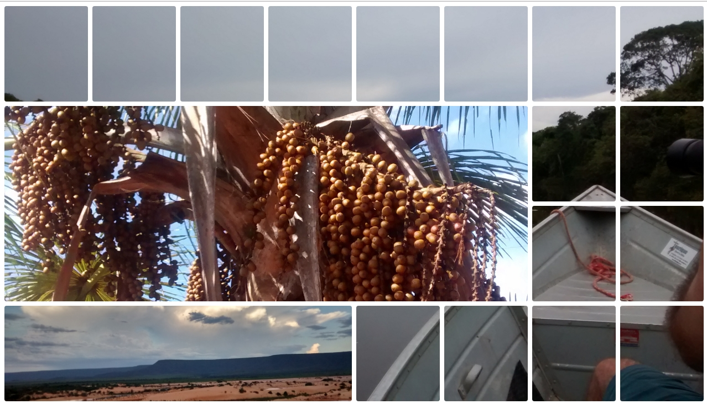

# Mosaic CSS Grid
> Behold the power of the CSS Grid auto organization ¨\\\_(\*0\*)\_/¨

<a href="https://treedbox.github.io/mosaic-css-grid"></a>

Mosaic CSS Grid auto organization with a bunch of images at differents sizes finding a place to fit. 

## Online Test
[https://treedbox.github.io/mosaic-css-grid](https://treedbox.github.io/mosaic-css-grid)

## FAQ
##### 1. What makes the grid so well organized?
```css
.mosaic{
  grid-auto-flow: dense;
}
```
##### 2. How to join 2 (or more) grid cells?
In a grid where the cells are:
```
1 2 3 4
5 6 7 8
```
Supose that we select the **2nd** cell:

```css
.mosaic div:nth-child(2){
  grid-column: span 2;
}
```

The 2nd cell will span for two cells, reaching the next column:
```
1 2-2 3
4 5 6 7
8
```
And:
```css
.mosaic div:nth-child(2){
  grid-row: span 2;
}
```
The 2nd cell will span for two cells, reaching the next row:
```
1 2-2 3
4 2-2 5
6 7 8 9
```
Because of `dense` at `grid-auto-flow: dense;`, the grid will realocate all others cells organized where it fits best.

##### 3. How to make those round corners without holes?
For the cells:
```css
.mosaic div{
  border-radius: 8px;
  box-shadow: 0 0 0 4px #fff inset;
  outline: 4px #fff solid;
  outline-offset: -4px;
}
```
Make sure that the `border-radius` is **2 times** bigger than `box-shadow`, `outline` and `outline-offset`, e.g. If you want a round border of `5px` you should set `border-radius: 10px` and all other `5px`, like:
```css
.mosaic div{
  border-radius: 10px;
  box-shadow: 0 0 0 5px #fff inset;
  outline: 5px #fff solid;
  outline-offset: -5px;
}
```
* `outline-offset: -5px;` make the `outline` stay over the holes between the cells.

Also set a border for the grid to compensate the gap size difference compared with the borders of the gid:
```css
.mosaic{
  border: 4px solid #fff;
}
```
`4px` for `border-radius: 8px;` of the cells, or `5px` for `border-radius: 10px;`


## Tested on
* Google Chrome 66

* Firefox 60


## Photos
#### Location 
* [Jalapão](https://goo.gl/maps/vHCkDwM1mq82)
  * Pedra furada (Holed stone)
  * Fervedouro (Boil place)
  * Dunas do jalapão (Dunes of the jalapão)
  * Lago das Dunas do jalapão (Lake of the Dunes of the jalapão)
  * Morro da catedral (Cathedral hill)
  * Cachoeira da velha (Old woman's waterfall)
  * Prainha da Cachoeira da velha (Small beach of the Old woman's waterfall)
  * Cachoeira véu de Noiva (Bride Veil waterfall)
  * Cachoeira do formiga (Ant's waterfall)
  * Árvore de buriti (Buriti tree)
  * Rio Formoso (Beautiful river)
  * Rio Novo (New river)
  * Tartaruga tracajá do Rio Novo ( tortoise tracaja of the new river)

Photos &copy; **Jonivon Amaral Marques**: Jalapão's Tourist guide

## Meta
Front-End Developer: [Jonimar Marques Policarpo](http://linkedin.com/treedbox 'LinkEdin')

Twitter: [@treedbox](http://twitter.com/treedbox)

E-mail: [treedbox@gmail.com](mailto:treedbox@gmail.com)

Site: [treedbox](http://treedbox.com)

## License
[MIT](LICENSE.md) © [TreedBox](https://github.com/treedbox)

[https://github.com/treedbox/mosaic-css-grid](https://github.com/treedbox/mosaic-css-grid)
